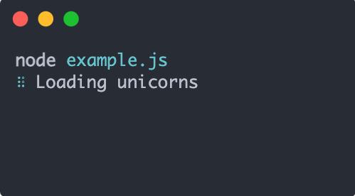
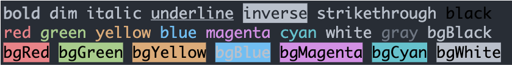

# 基于Node.js前端脚手架工具开发流程

我们要写一个叫`hello-cli`的脚手架工具，它要做的是从GitHub拉去项目模版代码，把项目信息填入模版内即可。这是一个简单但是很常见的脚手架功能。[脚手架源码](https://github.com/blogwy/cli-demo)

## 准备

开发脚手架工具，我们需要用到几个工具库

1. [commander.js](https://github.com/tj/commander.js) nodejs命令行完整解决方案，提供解析命令等功能，写脚手架必备库
2. [inquirer.js](https://github.com/SBoudrias/Inquirer.js) 命令行交互工具，支持大部分形式。写脚手架必备库
3. [download-git-repo](https://www.npmjs.com/package/download-git-repo) 下载GitHub库
4. [metalsmith](https://www.npmjs.com/package/metalsmith) 用于处理下载好的模版文件
5. [handlebars](https://www.npmjs.com/package/handlebars) 用户替换变量
6. [ora.js](https://github.com/sindresorhus/ora) 命令行loading样式，非必须



7. [chalk.js](https://github.com/chalk/chalk) 命令行文本加颜色背景等样式，非必须



8. [log-symbols.js](https://github.com/sindresorhus/log-symbols) 给`console.log`添加有颜色的级别，例如`error` `success`，非必须


9. [alphabetjs](https://github.com/starkwang/alphabetjs) 字符文字样式，主要用于项目名称，非必须

## 开发

初始化项目，在`package.json`里面写入`bin`字段。`key`定义cli的命令`hello-cli`，`value`定义了命令的入口文件。

```json
"bin": {
  "hello-cli": "bin/hello.js"
}
```

### 入口文件`hello.js`

首先要在所有的命令入口文件前写`#!/usr/bin/env node`声明使用当前系统的`node`环境。这里会使用`alphabetjs`把项目名字输出一个字符文字，然后再定义一下`usage` `description` `version`脚手架的基础信息。command方法定义一个命令，命令的接收后处理需要写到一个名为 入口名-命令名.js 文件里面，这里我们需要在bin下面创建一个hello-create.js文件

```javascript
#!/usr/bin/env node

const commander = require('commander')
const alphabetjs = require('alphabetjs')
const chalk = require('chalk')
const title = alphabetjs('Hello Cli','stereo')
const packageInfo = require('../package.json')

commander.addHelpText('beforeAll', chalk.greenBright(title));

commander
    .usage("[options]/[command]")
    .description('Hello World')
    .version(packageInfo.version)
    .command('create', 'Create an project')
    .parse(process.argv);
```

### create命令入口文件`hello-create.js`

使用`commander.parse()`方法解析输入的参数作为项目名，`download`方法下载模版，`generator`方法用来生成模版

```javascript
#!/usr/bin/env node

const commander = require('commander')
const ora = require('ora')
const chalk = require('chalk')
const logSymbols = require('log-symbols')
const download = require('../modules/download')
const prompt = require('../modules/prompt')
const generator = require('../modules/generator')
// 解析参数
commander.parse(process.argv)
// 接收第一个参数
const projectName = commander.args[0]
// 创建一个loading
const spinner = ora('downloading template');

// 没有项目名，提示help，退出
if (!projectName) {
  program.help()
  return
}

async function main (projectName) {
  const path = `${process.cwd()}/${projectName}`
  // 开始下载模版
  spinner.start()
  try {
    await download(path)
  } catch (error) {
    // 隐藏loading，打印错误信息
    spinner.stop()
    console.log(logSymbols.error, chalk.red('download error'))
    console.log(chalk.red(error))
    return
  }
  // 下载成功
  spinner.stop()
  // 收集数据
  const projectInfo = await prompt(projectName)
  // 生成模版
  try {
    await generator(projectInfo, path, path)
  } catch (error) {
    console.log(logSymbols.error, chalk.red('generator error'))
    console.log(chalk.red(error))
    return
  }
  // Finished
  console.log(logSymbols.success, chalk.green('Finished successfully!'))
}

main(projectName)
```

#### `download.js`说明

`download-git-repo`这个库可以下载`Github` `Gitlab`项目。默认下载`GitHub`，我这里是下载`blogwy`用户的`cli-demo-template`库`master`分支

```javascript
const download = require('download-git-repo')

module.exports = async function (path) {
  return new Promise((resolve, reject) => {
    download('blogwy/cli-demo-template#master', path, function (err) {
      err ? reject('Error') : resolve('Success')
    })
  })
}
```

#### `generator.js`说明

使用`handlebars`解析模版文件，模版文件需要接收参数的地方使用`{{}}`包裹，我这里把二进制文件`ico png`排除掉，因为会报错。把`vue`文件也排除掉

```javascript
const Metalsmith = require('metalsmith')
const Handlebars = require('handlebars')

// metadata 需要替换的数据，src 文件源地址，dest 输出地址
module.exports = function (metadata, src, dest) {
  if (!src) {
    return Promise.reject(new Error(`无效的source：${src}`))
  }
  
  return new Promise((resolve, reject) => {
    Metalsmith(process.cwd())
      .metadata(metadata)
      .clean(false)
      .source(src)
      .destination(dest)
      .use((files, metalsmith, done) => {
        const meta = metalsmith.metadata()
        Object.keys(files).forEach(fileName => {
          const fileNameArray = fileName.split('.')
          const disabledArray = ['vue', 'ico', 'png']
          if (!disabledArray.includes( fileNameArray[fileNameArray.length - 1])) {
            const t = files[fileName].contents.toString()
            files[fileName].contents = Buffer.from(Handlebars.compile(t)(meta))
          }
        })
        done()
      }).build(err => {
        err ? reject(err) : resolve()
      })
  })
}
```

```json
{
  "name": "{{projectName}}",
  "version": "{{projectVersion}}",
  "description": "{{projectDescription}}",
  "category": "{{projectCategory}}",
  "poster": "{{projectPoster}}",
  "author": "{{projectAuthor}}",
  "main": "index.js",
  "scripts": {
    "test": "echo \"Error: no test specified\" && exit 1"
  },
  "license": "ISC",
  "dependencies": {},
  "devDependencies": {}
}
```

## 测试

 `npm link`会把当前开发目录映射到全局，使用`hello-cli`就可以测试，测试完后`npm unlink`取消映射

```bash
npm link

npm unlink
```

## 发布

1. 注册npm账户
2. 执行`npm login`登录npm
3. 执行`npm publish`发布包

## 安装

```bash
npm i -g hello-cli
```

## 使用

```bash
hello-cli create 项目名
```